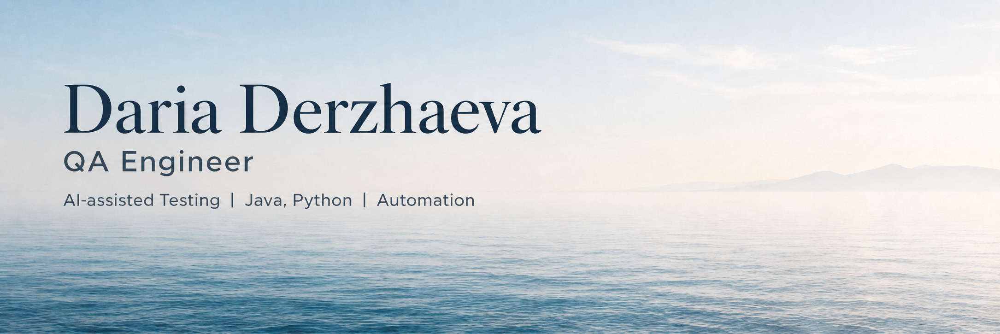

# Hi, I'm Daria 👋  
### QA Engineer | Test Automation | AI-assisted Testing | Java

I am a QA Engineer with 4+ years of experience testing complex web, backend, and API-driven systems in Fintech and enterprise domains.

I specialize in exploratory testing, testing without detailed specifications, API/data flow validation, bug reproduction, and test automation. I independently built UI and API test automation from scratch using Python, Selenium, Allure, and AI-assisted development tools.

I am interested in AI-powered developer tools, code generation, refactoring, debugging assistance, and validating AI-generated Java code for correctness, edge cases, and alignment with user intent.

---

## Resume & Links

⭐ [LinkedIn](https://www.linkedin.com/in/derzhaeva)  
⭐ [Email](mailto:derjaeva160@gmail.com)  
⭐ [Resume](./Daria_Derzhaeva_QA.pdf)

---

## Tech Stack & Skills

**Programming:** Java, Python  
**Java:** OOP, Collections, Generics, Stream API, Basic Multithreading, JUnit 5, Maven  
**Test Automation:** Selenium, Selenide, REST Assured, Allure  
**Testing:** Functional, Exploratory, Regression, Integration Testing  
**API & Data:** Postman, REST API, PostgreSQL, SQL, API/Data Flow Validation  
**AI & Developer Tools:** AI-assisted Testing, Prompt-based Testing, Generated Java Code Validation, Refactoring Scenarios, Debugging Assistance  
**Tools:** Git, Docker, Jira, YouTrack, DevTools

---

## Featured Project

### AI Assistant Java QA Suite

A personal QA project focused on testing AI-assisted coding features for Java developers.

The project includes exploratory test scenarios, Java code samples, evaluation criteria, and structured bug reports for AI-generated code, refactoring suggestions, debugging explanations, and chat-based developer assistance.

**Focus areas:**

- AI-generated Java code correctness
- Code compilability and runtime behavior
- Edge cases and negative scenarios
- Refactoring behavior validation
- Debugging explanation quality
- Alignment with user intent

Repository: [AI Assistant Java QA Suite](https://github.com/YOUR_USERNAME/ai-assistant-java-qa-suite)

---

## What I'm focused on

- Testing AI-powered developer tools
- Improving regression coverage through automation
- Designing clear and maintainable test scenarios
- Investigating complex backend, API, and data flow issues
- Learning more about Java, developer workflows, and AI-assisted coding
